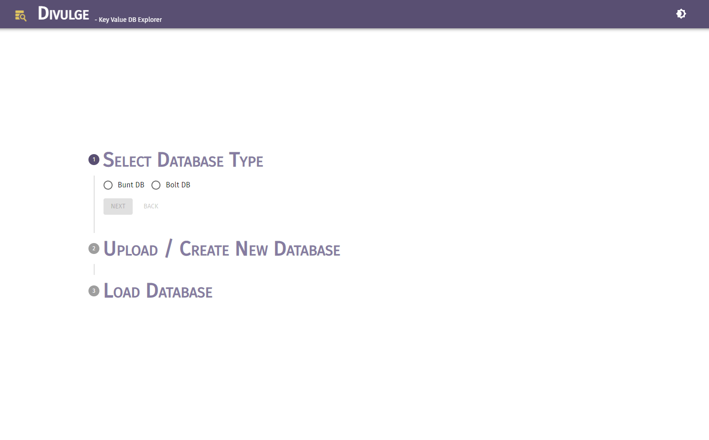
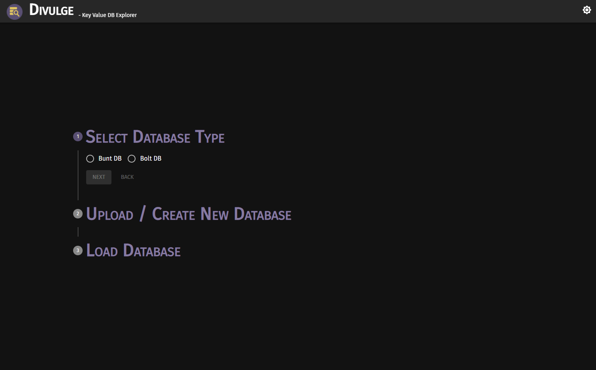
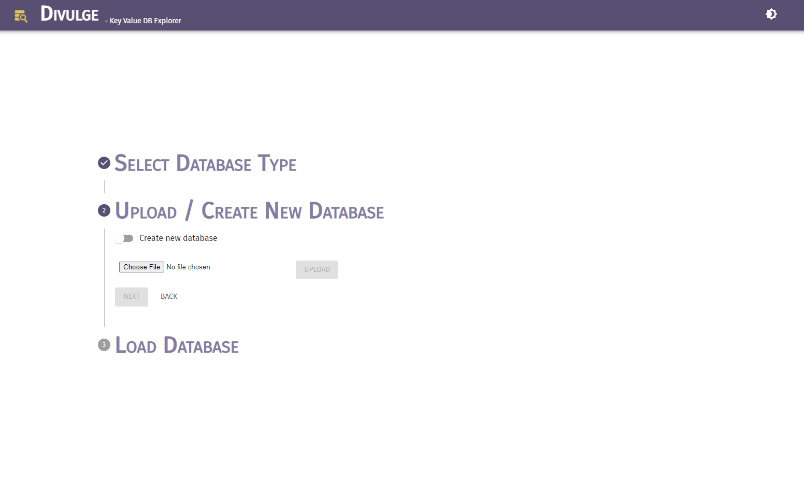
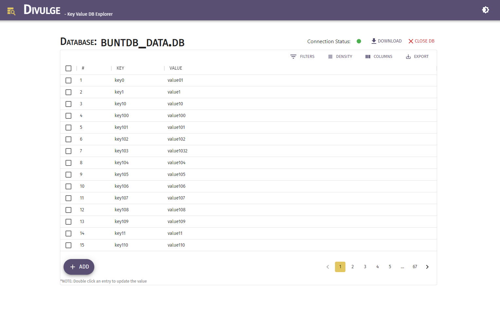
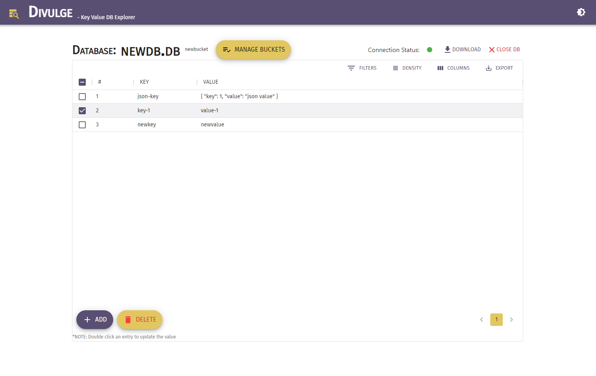
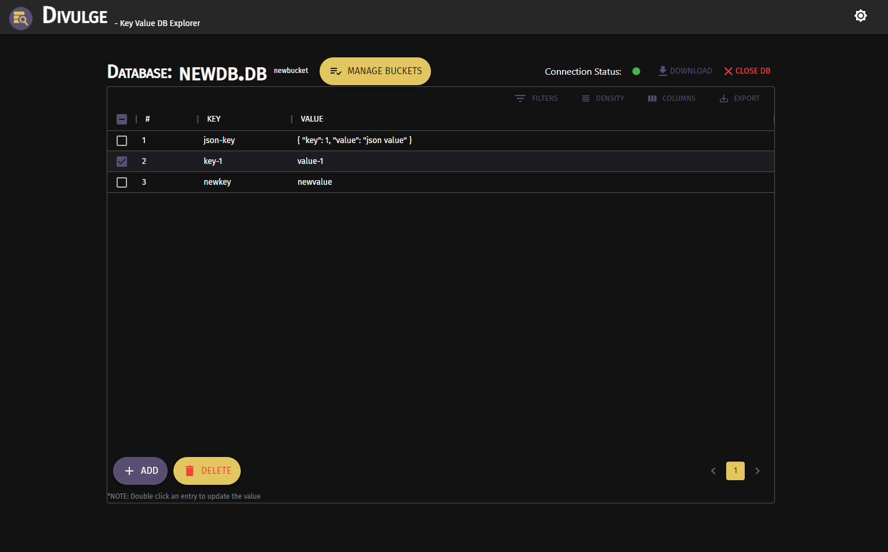

<div align="center">

<h1> Divulge - Golang Key Value Pair DB Web UI (WIP) </h1>
<h3> Divulge "makes known" Key-value DB data. It's yet another Golang service with a simple UI for managing and operating multiple Key Value pair DBs written in Golang. </h3>

[](https://github.com/ric-v/divulge-keyvalue-db-ui/actions/workflows/go.yml)
[](https://github.com/ric-v/divulge-keyvalue-db-ui/actions/workflows/codeql-analysis.yml)
[](https://img.shields.io/badge/Maintained%3F-yes-green.svg)
[](https://goreportcard.com/report/github.com/ric-v/divulge-keyvalue-db-ui)
[](https://www.codefactor.io/repository/github/ric-v/divulge-keyvalue-db-ui)
[](https://sonarcloud.io/summary/new_code?id=ric-v_divulge-keyvalue-db-ui)
[](https://pkg.go.dev/github.com/ric-v/divulge-keyvalue-db-ui/database#)


</div>

---

Simple DB CRUD operations service. Supports some golang Key-Value pair file based Databases. Upload the DB create a local copy and modify/view data and download the updates.

<!--  -->

## Features

- [x] ~~Upload existing DB~~
- [x] ~~View Key-Value pairs~~
- [x] ~~Add new Key-Value pair~~
- [x] ~~Remove Key-Value pair~~
- [x] ~~Update Key-Value pair~~
- [x] ~~Download updated file~~
- [x] View Buckets in boltDB
- [x] Add / remove bucket
- [ ] Move/Copy Key-Value pair under a bucket to another bucket

## Usage

Download the latest [release from here](https://github.com/ric-v/divulge-keyvalue-db-ui/releases)

- ### windows

  - Unzip / Untar the release
  - Open the folder
  - Run the .exe file (in the pop up screen, click more info > Run anyway > allow firewall access if the pop-up comes)
  - The service will be available at <http://localhost:8080/>

- ### linux

  - Unzip / Untar the release
  - Open the folder in terminal
  - Run commands:

  ```bash
  chmod +x divulge-viewer-*-amd64
  ./divulge-viewer-*-amd64
  ```

  - The service will be available at <http://localhost:8080/>

## Screeshots

**Home screen:**

**Home screen Dark side:** 

**Upload/Create new DB:** 

**BuntDB paginated view:** 

**BoltDB view:** 

**BoltDB view dark side:** 

**Manage buckets:** 

## Supported DB

- [BuntDB](https://github.com/tidwall/buntdb)
- [BoltDB](https://github.com/boltdb/bolt) (WIP)

## Technologies used

- [Golang 1.17.x](https://go.dev/)
- [ReactJS 17.x](https://reactjs.org/)
- [Material UI v5.x](https://mui.com/)
- [fasthttp](https://github.com/valyala/fasthttp) ([fasthttp mux](https://github.com/fasthttp/router))
- [BoltDB](https://github.com/boltdb/bolt)
- [BuntDB](https://github.com/tidwall/buntdb)

_Code.Share.Prosper_
